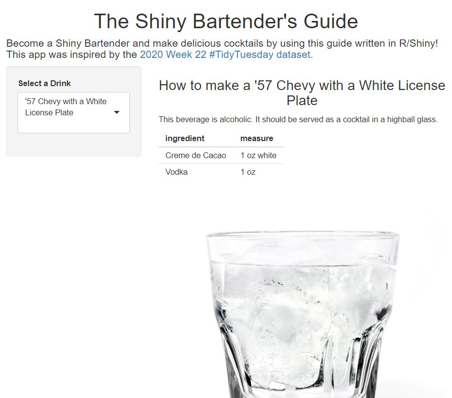
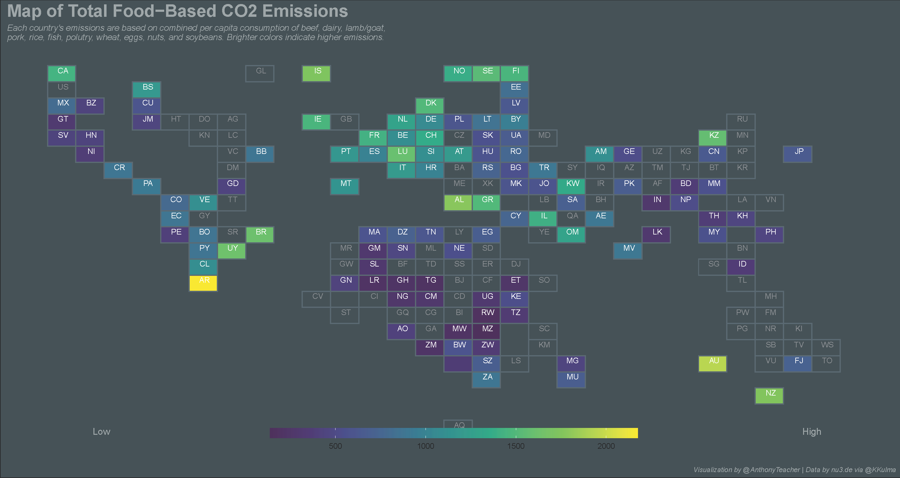
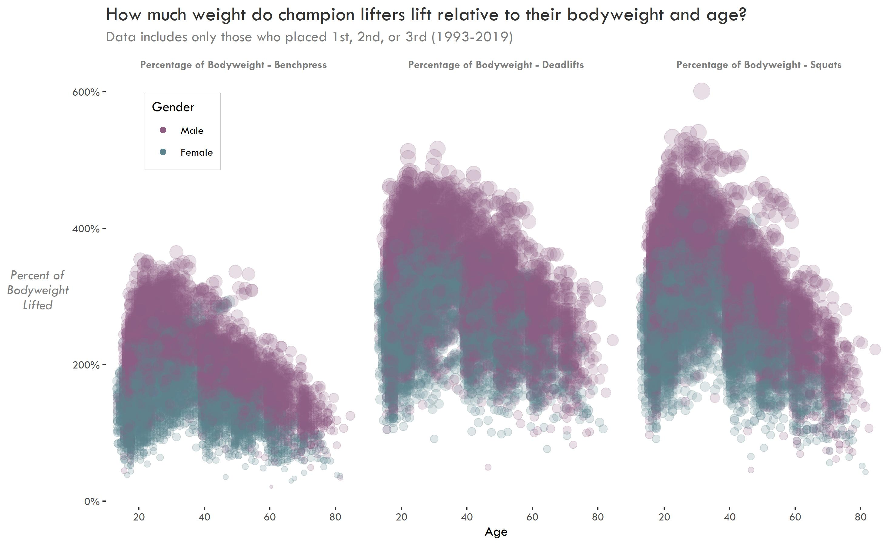
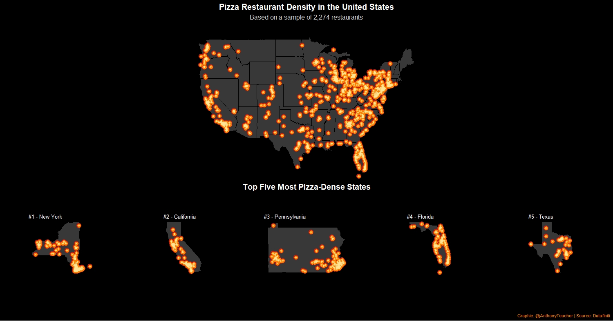
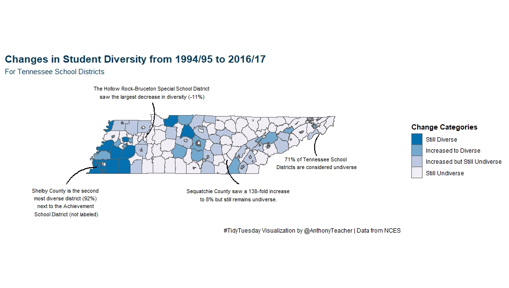

## #TidyTuesday Contributions

I follow #TidyTuesday every week to improve my R and visualization skills. I have also participated several times. This repo contains my contributions. Warning: code may be messy!

## 2020 Week 22 - Cocktails

[Original Dataset](https://github.com/rfordatascience/tidytuesday/blob/master/data/2020/2020-05-26/readme.md)

### Interactive Shiny App

[{width=500px}](https://acircleda.shinyapps.io/ShinyBartender/)

## 2020 Week 8 - Food's Carbon Footprint

[Original Dataset](https://github.com/rfordatascience/tidytuesday/blob/master/data/2020/2020-02-18/readme.md)

[**Carbon Crisis Mitigation: Whose Responsibility Is It? - A #TidyTuesday-inspired Essay**](https://www.anthonyschmidt.co/post/2020-19-02-carbon-crisis-mitigation-whose-responsibility-is-it-a-tidytuesday-inspired-essay/)

### Contribution 1: Cholorpleth Map

[{width=500px}](https://github.com/acircleda/TidyTuesday/tree/master/2020-02-18%20-%20Food%20Emissions)

### Contribution 2: Tile Map

[{width=500px}](https://github.com/acircleda/TidyTuesday/tree/master/2020-02-18%20-%20Food%20Emissions)

## 2019 Week 41 - Powerlifting

[Original Dataset](https://github.com/rfordatascience/tidytuesday/blob/master/data/2019/2019-10-08)

### Contribution: Scatterplot

[{width=500px}](https://github.com/acircleda/TidyTuesday/tree/master/2019-10-8%20-%20Powerlifts)

## 2019 Week 40 - All the Pizza

[Original Dataset](https://github.com/rfordatascience/tidytuesday/blob/master/data/2019/2019-10-01)

### Contribution: Map

[{width=500px}](https://github.com/acircleda/TidyTuesday/tree/master/2019-10-1%20-%20Pizza)

## 2019 Week 39 - School Diversity

[Original Dataset](https://github.com/acircleda/TidyTuesday/tree/master/2019-10-1%20-%20Pizza)

### Contribution: Diversity in Tennessee

[{width=500px}](https://github.com/acircleda/TidyTuesday/tree/master/2019-09-24%20-%20School%20Diversity)

